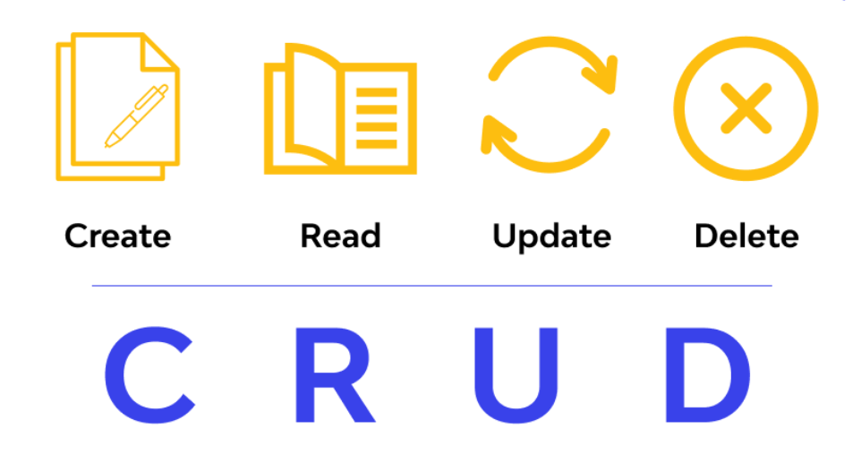

 
    
    <h2 align="center">🎉 Nodejs CRUD RESTAPI - ( MySQL / MongoDB ) 🏬</h2>

Create a simple CRUD RESTAPI using Nodejs, Express, MySQL, and MongoDB. The application will connect to MySQL/MongoDB database and allow users to create, read, update, and delete blog posts.

---

| **Method** | **EndPoint**   | **Description**  | 
|:----------:|:--------------:|:----------------:|
| **GET**    | api/posts      | Get all posts    |
| **GET**    | api/posts/:id  | Get post by id   |
| **POST**   | api/posts      | Create post      |
| **PUT**    | api/posts/:id  | Update post      |
| **Delete** | api/posts/:id  | Delete post      |
| **Delete** | api/posts      | Delete all post  |

---

### 🪛 Getting Started

The quickest way to get started as shown below:

#### `npm i && npm run devStart`

View the website at: http://localhost:3000
